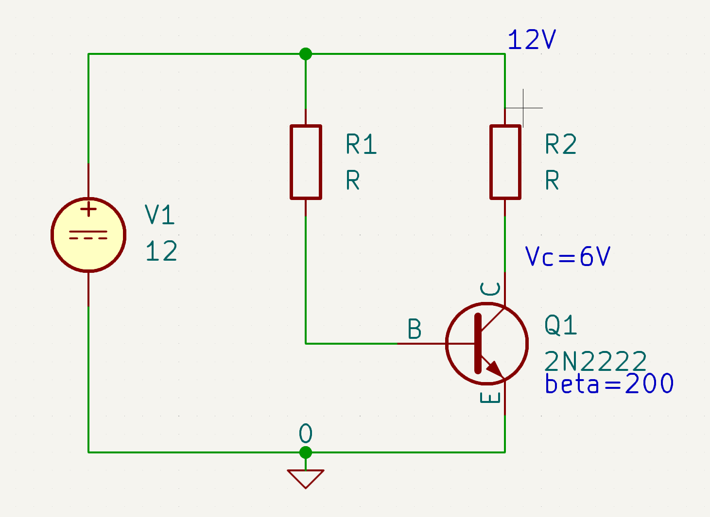
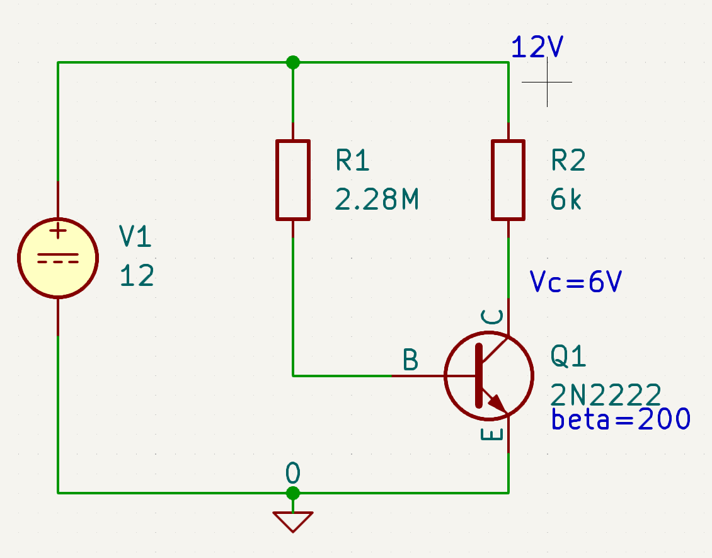
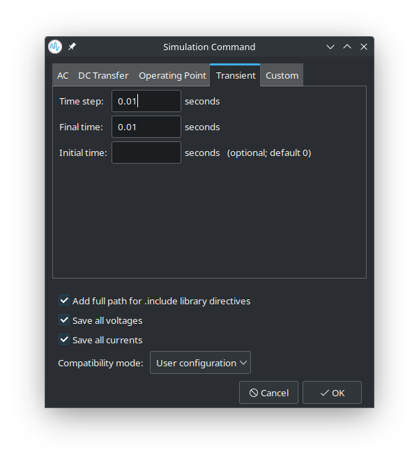
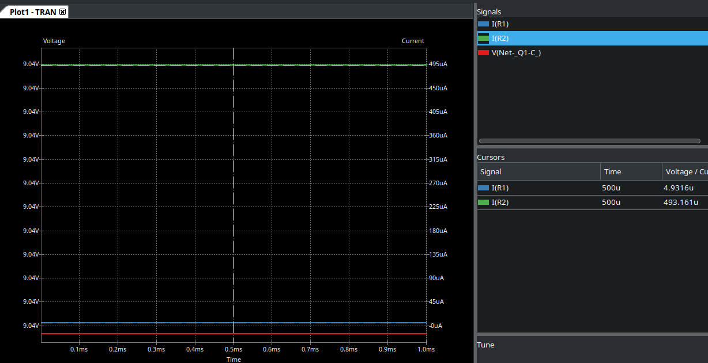
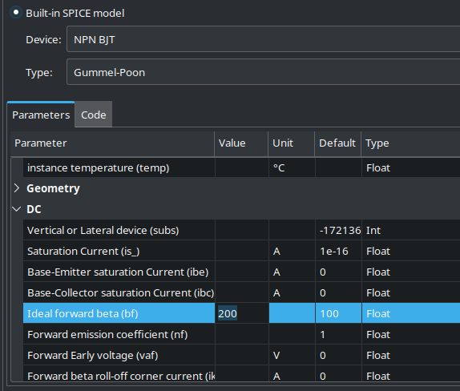
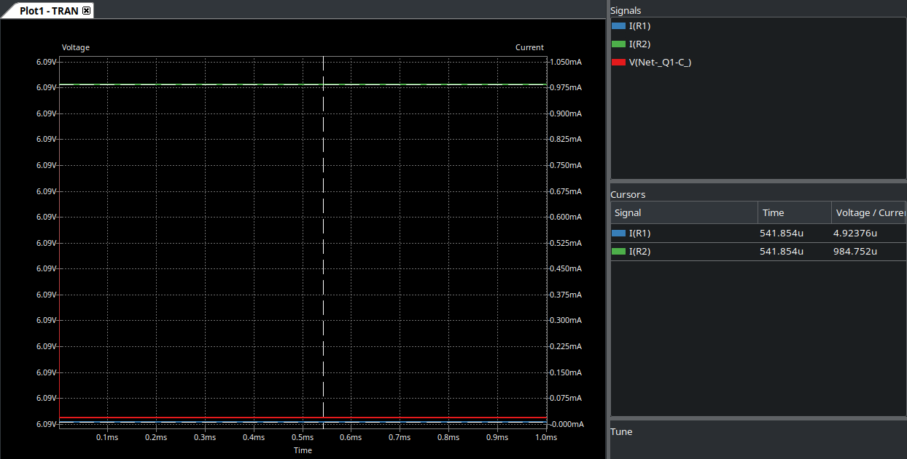

# Exercise 1: Fixed Bias for NPN Transistor

## Goal: 
Determined R1 value, let Ie ~= 1mA, Vce=6V, assume 2N2222 𝜷 value ~= 200

## Requirements: 
- List calculation assumption,
- List steps that calculate R1
- Use SPICE to verify results

# Assumption

# Steps
R2: ~1mA through R2, 6V difference, 6V/0.001A ~= 6kOhms
R1: 1/200 of 1mA through R1, 12V-0.6V difference, 11.4V/0.000005A ~= 2.28MOhms

# Verification

After creating the schematic in KiCad, and filled in the resistor values, I created a SPICE workbook under `Inspect > Simulator`.

I probed the voltage on Vc, and found it to be ~9V, which is very off from 6V.

I immediately suspected the issue is at ngspice, KiCad's SPICE simulator, so I installed a version of LTSpice on Wine.

However, it now seemed like a whole Amp was flowing through the voltage source, and found out that LTSpice automatically converts M(Mega) into m(micro) when inputting the values, and I had to change it to 2280k instead.

But it still showed that Vc is 9V.

I turned back to KiCad and checked the simulation model for the transistor, and I realized that the `ideal forward beta(bf)` parameter is set to 100 by default, which explains the ~100x current difference on the last simulation.

After changing it to the assumed beta value of 200, I was able to get acceptable results:

